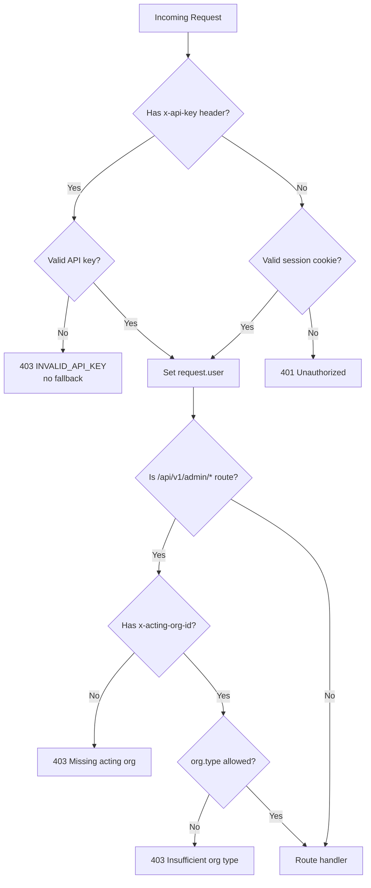

The API mounts Better Auth under:

```text
/api/auth/*
```

The auth instance is created in `apps/api/src/routes/auth/create_auth.ts` using the shared auth package.



## Middleware Behavior

Protected routes use `auth_middleware_if_enabled`.

Behavior:

:::caution[Kill switch]
`AUTH_MIDDLEWARE_ENABLED=false` disables all auth checks. This exists only for migration scripts and seed operations that run outside the request path. Never set this in production.
:::

- in production, auth middleware is always enabled
- in development, `AUTH_MIDDLEWARE_ENABLED=false` can disable protected route checks
- item creation and local item fetch require an authenticated user when middleware is enabled
- action/event list endpoints use the authenticated user to filter ownership snapshots

## Unified OTP Routes

The UI uses:

```text
POST /api/auth/unified-otp/check-user
POST /api/auth/unified-otp/request
POST /api/auth/unified-otp/verify
GET  /api/auth/get-session
POST /api/auth/sign-out
```

`CREATE_TEST_OTP=true` enables predictable OTP behavior for development/testing.

## Trusted Origins

Trusted origins are derived from:

- configured allowed origins
- origins discovered from network config instances for served domains

This allows instance-aware CORS while keeping browser clients constrained to known origins.
