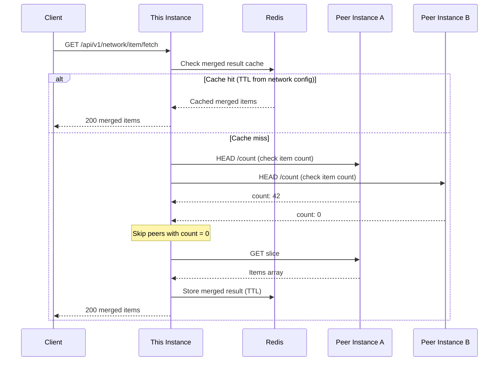

Network fetch is the API path for browsing items across registered instances.



## Public Route

```text
GET /api/v1/network/item/fetch
```

This route:

1. loads the requested network config
2. checks the requested domain exists
3. discovers registered instances for that domain
4. asks each instance for local counts
5. excludes zero-result instances
6. builds a page plan
7. fetches only the needed slices
8. merges the result
9. caches counts/pages in Redis

## Internal Instance Routes

```text
POST /api/v1/network/item/count_local
POST /api/v1/network/item/fetch_local
```

These are server-to-server helpers used by the aggregator. They are scoped by `SERVED_DOMAINS`, so an instance only answers for domains it serves.

## Cache Policy

The query may include `cache_ttl_seconds`, but runtime cache behavior honors the domain's `minimum_cache_ttl_seconds` from the network schema.

Use the domain cache value to prevent clients from forcing overly aggressive refreshes across a network.

## When To Use Local vs Network Fetch

Use local fetch for:

- “my items”
- owner-specific dashboards
- current instance administration

Use network fetch for:

- public discovery
- cross-instance search
- marketplace/network browsing
- map/list views across peer instances
