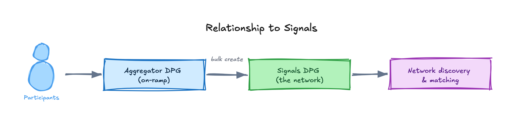

An **aggregator** is anyone connected to a Blue Dot who can **verify its details, and thereby drive trust in it** — while onboarding participants and bringing their signals onto the network at scale. The **Aggregator DPG** is the application they use.

That verification role is the point. Volume without credibility is just a list; an aggregator is what makes a Blue Dot believable to the other side of the market.

## Who can be an aggregator

Any organisation with **reach and trust on the ground** for a given cohort:

| Aggregator type | Typical cohort |
|---|---|
| Colleges and ITIs | Graduating batches, students |
| Skilling centres | Trainees completing a course |
| MSME associations | Member businesses and their vacancies |
| Project Implementation Agencies | Programme beneficiaries |
| Employment exchanges | Registered job seekers |
| NGOs and civil-society organisations | Communities they already serve |
| Government departments | Scheme beneficiaries, district cohorts |

Picking the right aggregator is [step 1 of the lifecycle](/core-concepts/blue-dot-lifecycle/#1-to-become-a-blue-dot): the adaptor decides who should become a Blue Dot, then identifies the partner who can actually get to them.

## Why aggregators matter

Signal volume is the fuel for local discovery. Asking every citizen to self-onboard is slow; aggregators already hold relationships with hundreds or thousands of participants. By letting an aggregator register and bulk-load its participants, the network reaches useful signal density quickly — which is exactly what the Ghaziabad and Dharwad pilots demonstrated.

## What the Aggregator DPG does

The Aggregator DPG is aggregator-facing and provides:

- **Registration & approval** — an organisation registers, is reviewed, and is approved onto the network.
- **Organisation → coordinator hierarchy** — a parent organisation owns many coordinators, and coordinators join **by invitation only**. See [How coordinators join](#how-coordinators-join) below.
- **Profile management** — schema-driven forms (RJSF) let non-engineers evolve registration and profile fields without code changes.
- **Bulk upload** — CSV/file-based creation of many participant signals at once, processed asynchronously by a background worker.
- **Registration links & metrics** — shareable links for self-registration, with roll-up metrics.
- **Verification** — the human review that turns a checked profile into a *Blue Dot Verified* one.

## Four intake methods

Assisted onboarding is not one flow. Four intake methods ship ready-made, and an aggregator simply runs whichever fits the context:

| Method | What it looks like | Mechanism |
|---|---|---|
| **Offline camp** | Data collected in person, e.g. at a job fair | Aggregator portal, assisted entry |
| **Bulk upload** | An existing list (CSV, database) imported in one go | CSV → background worker → bulk-create |
| **Outbound campaign** | Proactive outreach over email or a voice bot | Notifications + voice DPG |
| **Inbound campaign** | Participants scan a shared QR code and start on their own | Registration links, with roll-up metrics |

The choice of **assisted or self** route, and of intake method, is a configuration decision made per campaign or geography — not a technical build. See [The Blue Dot Lifecycle](/core-concepts/blue-dot-lifecycle/#2-choose-the-route-in).

## How coordinators join

Coordinators no longer register themselves against an organisation. Since the
org-hierarchy release they join **by invitation only**, so the organisation
owner decides who gets in.

The whole feature sits behind the per-instance **`ORG_HIERARCHY_ENABLED`** flag,
read at startup by **both** the API and the web app — set it identically on each.
With it off, the flat registration flow is unchanged and the org routes are not
registered at all (they return 404).

### The flow

1. **The organisation registers.** The owner opens `/register/owner` — a
   deep link, deliberately not advertised on the public registration page, so
   it reaches an owner by direct link or QR rather than by browsing.
2. **A reviewer approves it.** Approval is an atomic decision on the
   organisation record; it mirrors a Keycloak group and grants the owner the
   `org_owner` realm role.
3. **The owner receives an invite link.** The approval email carries a
   **90-day grant link** to `/register/invite?grant=…`. That page is the owner's
   only entry point: their Keycloak user stays **disabled** by design, so there
   is no account for them to sign in with.
4. **The owner invites coordinators by email.** Each recipient gets their own
   **one-time, 14-day invite**. The two lifetimes differ on purpose — a 14-day
   grant would strand an owner who cannot log in to request a new one.
5. **Each coordinator registers through their invite**, and is stamped with the
   organisation as their parent.

### If the owner loses the link

The grant is a signed token, not a stored record, so there is nothing to look
up and resend. Two recoveries exist:

- **An expired grant is self-healing** — opening it and submitting mints a fresh
  link and emails it to the organisation's registered owner address.
- **Re-submitting the organisation registration** with the same owner email
  re-sends the link. This path is rate-limited per owner address, so a rapid
  second attempt is refused with a `Retry-After` rather than a fresh mail —
  every admitted call mints another live 90-day credential. Mail always goes to the **stored** owner address, never the
  address on the new submission — that endpoint is anonymous, so honouring the
  submitted address would hand a stranger the organisation's credential.

### Why invitation-only

The organisation owner is accountable for who represents it on the network. Open
self-registration against a known organisation name would let anyone claim
affiliation, and the aggregator's whole trust model rests on `aggregator_id`
being an assertion the platform makes, not a claim the client supplies.

## The trust boundary

The Aggregator DPG reads from the upstream Signals stack and, in the MVP, has **no write access to Signals except through the controlled bulk-create paths**. Every request is scoped to a verified `aggregator_id`, which is **never trusted from the client** — it is asserted from the authenticated session. This keeps one aggregator from ever reading or writing another's data.

Integrating DPGs (such as the Aggregator app, or a voice DPG) authenticate to Signals with a **Keycloak client-credentials service token**, sent alongside an acting-org header. See [Identity & Auth](/core-concepts/architecture/identity-and-auth/) for the full model.

## Relationship to Signals

<!-- Editable source: src/assets/diagrams/aggregators-relationship.excalidraw — open at https://excalidraw.com to adjust, re-export PNG here. -->

The Aggregator app is the on-ramp; the Signals DPG is the network. Adaptors usually stand up Signals first, then add the Aggregator app as partner organisations come on board.

## Where to go next

- [The Blue Dot Lifecycle](/core-concepts/blue-dot-lifecycle/) — the seven steps an aggregator's participants walk.
- [Aggregator DPG Architecture](/core-concepts/architecture/aggregator-dpg/) — the API, portal and worker.
- [Aggregator DPG Setup](/guides/installation/local-setup/aggregator-dpg/) — install and run it.
