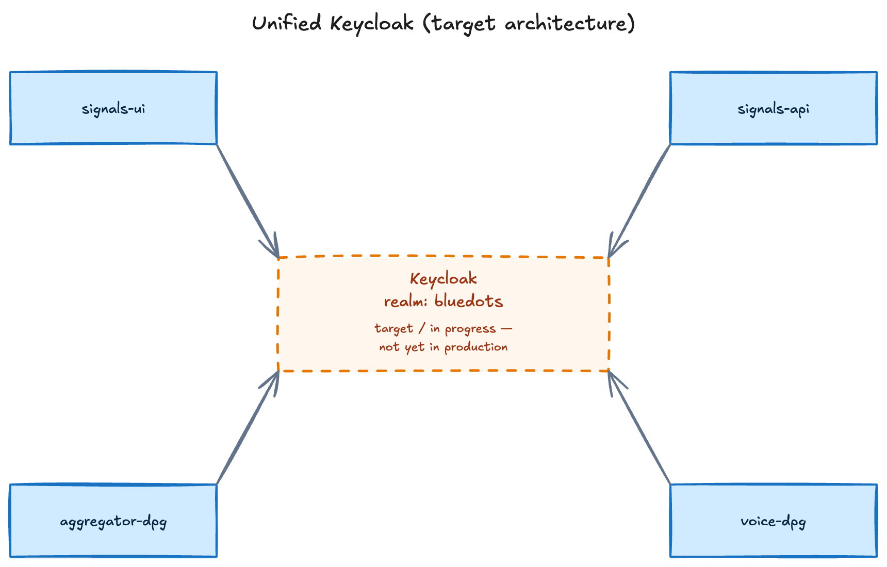

The stack currently runs **three** identity paths, joined by service-auth handshakes. A shared-realm Keycloak architecture is fully built and merged, but not yet promoted to production — see [In progress: unified Keycloak](#in-progress-unified-keycloak-new) below.

## Today

This section describes exactly what's deployed in production right now.

### Aggregator: Keycloak (OIDC)

The Aggregator stack authenticates users with **Keycloak**, realm `aggregator` (imported on first boot). Three clients exist:

- `aggregator-portal` — the web portal (OIDC authorization-code flow).
- `aggregator-api` — the API's own service account.
- `aggregator-bff` — the web app's backend-for-frontend service account, split out from `aggregator-api` so each app's client secret can be rotated independently.

A custom **OTP-by-email/phone** authenticator (a Keycloak SPI) is bundled with the realm, along with the protocol mappers the app depends on — including `aggregator_id` and `phone_number` user attributes mapped to token claims. These ship as part of the checked-in realm import, not a manual post-import step; without them the profile endpoint returns `403 MISSING_AGGREGATOR_ID`.

The golden rule: **`aggregator_id` is never trusted from the client.** Every handler asserts it from the authenticated session, so one aggregator can never read or write another's data.

### Signals: Better-Auth + API keys

The Signals API supports **two distinct auth paths**, both handled in one middleware:

1. **API-key path** — `x-api-key` is checked first. If present but invalid, the request fails immediately with `403 INVALID_API_KEY` (no fallback). This is how integrating DPGs (the Aggregator app, a voice DPG) authenticate.
2. **Session path** — used by the Signals UI when `x-api-key` is absent (Better-Auth).

Admin endpoints (`/api/v1/admin/*`) additionally require an **`x-acting-org-id`** header, validated against the organisation's `type` (`network_service` | `aggregator` | `voice`). The middleware populates `request.user` and `request.acting_org`; routes read those rather than re-parsing headers.

`AUTH_MIDDLEWARE_ENABLED` (default `true`) gates running migrations or seed scripts that must not hit the auth path — but setting it to `false` **only takes effect when `INSTANCE_ENV=development`**. In production it is forced back to `true` regardless of this setting, so it is not a switch an operator can use to disable auth in a deployed environment.

### signals-search: `x-api-key` only <span class="sprint-badge">New</span>

signals-search authenticates purely via **`x-api-key`** — it does not send or check `x-acting-org-id` at all. This is a **permanent, known divergence** from the two-header model the other integrating DPGs use (below), not a gap awaiting a fix.

### notification-service: HMAC request signing <span class="sprint-badge">New</span>

notification-service is a **fourth participant** in the ecosystem's auth landscape, using a **third, distinct service-auth pattern** alongside Keycloak, Better-Auth, and the `x-api-key` models above: every route requires a signed request — HMAC-SHA256 over the method/path/timestamp/nonce — with nonce-based replay protection. It shares no session or key store with the other paths. See [Notification Service Architecture](/core-concepts/architecture/notification-service/) for the full mechanism.

### The two-header service-auth model

When an integrating DPG other than signals-search calls Signals, it presents **two headers**:

```http
x-api-key: <the integrating DPG's API key>
x-acting-org-id: <the organisation it is acting as>
```

This lets Signals authenticate the *caller* (API key) and authorise the *action* (acting-org type) in one step. This model is documented in the Signals repo at `docs/operations/integrating-dpgs.md`.

### Deployment note

When moving off `localhost`, update the `aggregator-portal` client's **Valid Redirect URIs** and **Web Origins** in the Keycloak admin console, and replace `localhost`/`keycloak` hostnames throughout the environment config. See [Deployment](/guides/deployment/).

## In progress: unified Keycloak <span class="sprint-badge">New</span>

:::note[Not yet in production]
Everything in this section is built and merged, but **not yet promoted to `main`/production**. It is documented here so the target architecture is visible, not because it's live today.
:::

A shared **`bluedots`** Keycloak realm replaces Aggregator's standalone `aggregator` realm, serving both Signals-DPG and aggregator-dpg — and future integrating DPGs — from one realm instead of one per stack.

<!-- Editable source: src/assets/diagrams/unified-keycloak-target.excalidraw — open at https://excalidraw.com to adjust, re-export PNG here. -->



Key pieces of the target architecture:

- **Signals-DPG gains Keycloak support behind a flag.** An `AUTH_PROVIDER` setting selects the auth provider; the default stays Better-Auth, so existing deployments are unaffected until an operator opts in. Cutover also requires an explicit migration step to move existing users into Keycloak before flipping the flag — it isn't a live switch.
- **aggregator-dpg's calls to Signals-DPG gain a second auth mode.** Alongside the existing `x-api-key` handshake, calls can now also authenticate with a bearer token obtained via Keycloak client-credentials. This is **additive, not a replacement** — `x-api-key` keeps working, and `x-acting-org-id` is unchanged under either mode.
- **A pre-login entitlement check.** Aggregator login now checks entitlement before starting the login flow, so a user who only has a Signals-side identity (no aggregator entitlement) is rejected up front instead of getting partway through the aggregator login flow first.

Together these mean the unified realm, the additive bearer-token mode, and the pre-login gate can all land independently and be cut over deployment-by-deployment, rather than requiring a single big-bang switch.
