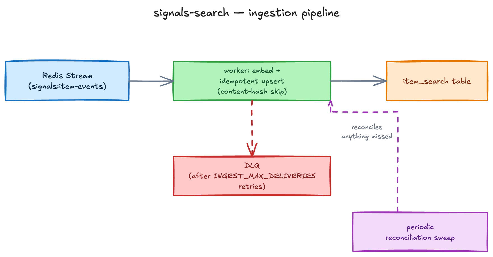

New page — sprint 2026-08-14

**Signals Search** (`signals-search`) is the search & discovery service for Signals-DPG — a Postgres-native replacement for an earlier Elasticsearch-based design, and a deliberate stepping stone toward a future Beckn/NFH discovery service. It is **V1**: single-instance, no cross-instance federation. It reads and writes only the shared Signals-DPG Postgres database, adding one read-model table (`item_search`) that stores a vector embedding and a geography per item.

## Components

- **`api`** and **`worker`** — two long-running processes built from one image, with the entrypoint chosen at deploy time (the API is the default). The API serves the query routes; the worker runs the ingestion pipeline. The two share no in-process state — only the `item_search` table and a Redis stream coordinate them.
- **Embedding sidecar** — a HuggingFace TEI (Text Embeddings Inference) deployment serving the default embedding model, **BGE-M3** (Apache-2.0, 1024-dim), over an OpenAI-compatible API, plus an optional cross-encoder reranker model. Hosted embedding providers are opt-in via configuration; an open-source default is always available.
- **`item_search`** — the read-model table the worker writes and the API queries (vector + geography columns, composite primary key on the item's network/domain/type/id). Its schema is owned by Signals-DPG; signals-search applies its own copy of the migration only in local/test environments and otherwise expects the table to already exist.

## Ingestion pipeline

<!-- Editable source: src/assets/diagrams/signals-search-ingestion.excalidraw — open at https://excalidraw.com to adjust, re-export PNG here. -->

Signals-DPG's item write path enqueues item changes onto a Redis Stream. The worker consumes the stream, reads the item's public attributes, embeds the configured fields, and upserts the corresponding `item_search` row. Only public attributes are ever vectorized — private item state is never decrypted for embedding, and results are always returned with state masked the same way the rest of Signals-DPG masks it.

Ingestion is idempotent by design: a content hash lets the worker skip re-embedding when nothing relevant has changed, and the upsert is keyed on the item's full identity, so a redelivered or reprocessed message is always safe. A message that keeps failing is retried up to a configured delivery limit before being parked on a dead-letter stream for operator triage, rather than blocking the consumer indefinitely. Alongside the stream, a periodic reconciliation sweep re-indexes anything that changed since it was last indexed and prunes `item_search` rows whose source item is gone — a safety net for anything the stream path missed.

## Search API

The API exposes three authenticated routes:

- **`POST /v1/search`** — the main discovery endpoint, using a Beckn-aligned `context`/`message` envelope. It supports three query modes: similarity to an existing item's own stored vector (no embedding call — "find items like this one"), similarity plus a geospatial radius (centered on an explicit point, or, if omitted, on the anchor item's own stored location), and free-text queries embedded at request time. Structured filters (equality, comparisons, array containment) can be combined with any mode. Only `live`-lifecycle items are returned, results are scoped by the cross-domain interaction matrix, and an optional cross-encoder rerank pass is **off by default**. Results are cached briefly (a short, configurable TTL) in Redis.
- **`POST /v1/search/flat`** — accepts the identical search as a flat, dot-delimited object of string values rather than a nested body, for tool-calling integrations (e.g. a voice-bot LLM tool layer) that can't emit deeply nested JSON. It unflattens the request and runs the same search path with the same responses.
- **`POST /v1/relevance`** — scores two specific items against each other (a directional source → target pairwise similarity, 0–100), reading their already-stored embeddings rather than embedding anything new. It lets Signals-DPG score item-to-item relevance in-network instead of depending on a separate external match-scoring service. Both items must already be indexed, live, and embedded with the same model version — a version mismatch is rejected rather than silently compared.

The principle across all three routes is **vectorize at write, rank at read**: no pairwise scores are ever stored; only the query (or nothing, for anchor search) is embedded online.

## Auth: a known divergence

Unlike the two-header (`x-api-key` + `x-acting-org-id`) model integrating DPGs use elsewhere in the ecosystem, signals-search authenticates every route with **`x-api-key` only**, validated against Signals-DPG's existing key store — there is no acting-org concept here. This is a **permanent, intentional divergence** for this service, not an in-progress gap. See [Identity & Auth](/core-concepts/architecture/identity-and-auth/) for the two-header model it diverges from.

## Tech stack

signals-search is a single TypeScript package rather than a Turborepo monorepo, and it talks to Postgres with parameterized `postgres.js` queries — there is no Drizzle or other ORM layer here. It is ESM NodeNext throughout, and its tests run against real Postgres (with pgvector + PostGIS) and Redis via Testcontainers rather than mocks. Its TypeScript and Vitest versions trail the other two repos — TypeScript by two majors, Vitest by one. See [Tech Stack](/core-concepts/technical/tech-stack/) for the full comparison.
