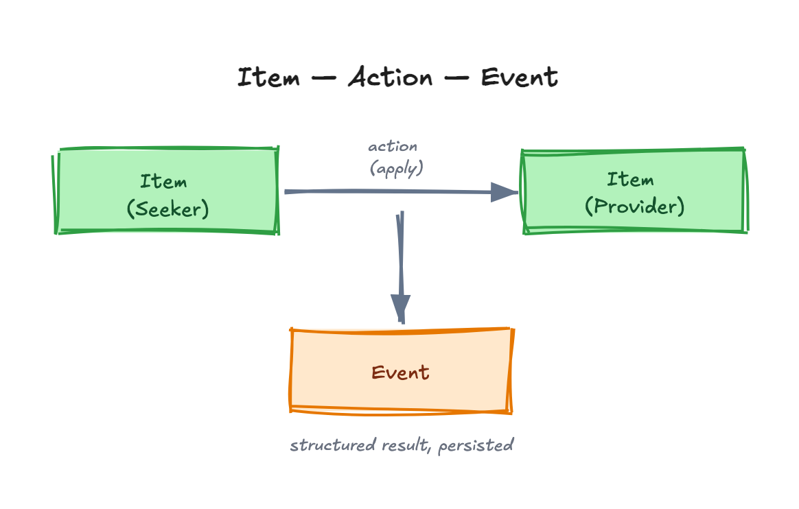

Inside an instance, everything is built from three primitives: **items**, **actions** and **events**.

## Item

An **item** is a versioned, schema-typed record — the unit of data in Signals. Examples: a participant `profile_1.0`, a job posting, a service offer.

- `item_type` is always a schema identifier such as `profile_1.0`, **never** freeform text.
- `item_instance_url` and `item_schema_url` are **generated by the backend** at creation time. Clients must not set them.
- Item tables are **partitioned** in the database; queries use partition-aware helpers so the planner can prune efficiently.

## Action

An **action** is an interaction *between items* — for example a seeker expressing interest in a provider's posting, or an aggregator linking a participant to an opportunity. Actions are the verbs of the system.

## Event

An **event** is the *structured result* of an action — the durable, machine-readable record that "X expressed interest in Y at time T". Events are what downstream analytics and impact measurement consume.

## How they relate

<!-- Editable source: src/assets/diagrams/items-actions-events.excalidraw — open at https://excalidraw.com to adjust, re-export PNG here. -->

A signal lifecycle, in these terms:

1. Create **items** for the seeker and provider.
2. The network discovers compatible items.
3. An **action** connects two items.
4. An **event** records the outcome — feeding match-quality improvements and district-level impact metrics.

For how items are read locally vs. across the network, and how they are written, see [Read & Write Paths](/core-concepts/technical/read-write-paths/). For the full term list, see the [Glossary](/core-concepts/glossary/).

## In progress: per-pair action cap

:::note[Not yet in production]
Everything in this section is built and merged, but **not yet promoted to `main`/production**. It is documented here so the target architecture is visible, not because it's live today.
:::

A network can configure `max_actions_per_pair` in its `network.json` to cap how many open `apply`/`connect` actions may exist between the same two items at once. Left unset, the cap defaults to **1**.

- **One shared budget, not one per action type.** An open `apply` and an open `connect` between the same pair of items count against the same cap — they don't get separate budgets.
- **Bidirectional.** The cap counts actions between the pair regardless of direction: an open action A→B and an open action B→A count the same, against the same limit.
- **Enforced server-side**, via a pair-scoped lock so concurrent submissions for the same pair can't race past the cap.
- Exceeding the cap returns `409 ACTION_LIMIT_REACHED` rather than creating the action.

This is separate from an action's *lifecycle* — once an existing action between the pair resolves (accepted, completed, cancelled, or rejected), the pair frees back up and a fresh action is allowed again.
